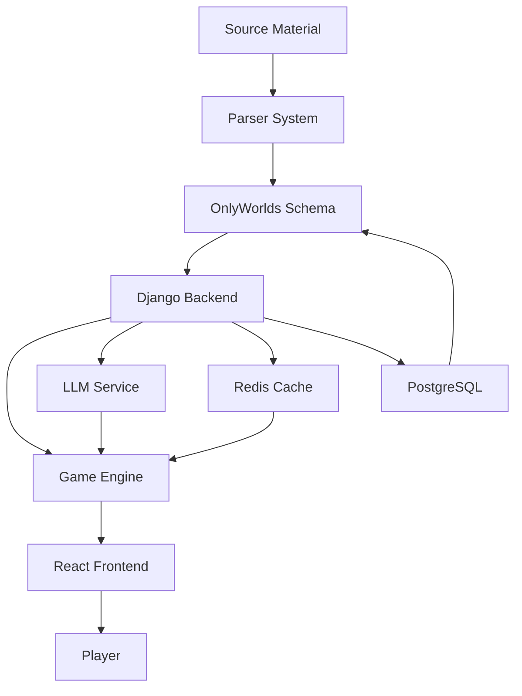

# Production Requirements Document: The Endless Nights Engine
*Final Systematic Development Plan*

## Executive Summary

A world-agnostic game engine that transforms OnlyWorlds data into atmospheric exploration experiences where knowledge has weight and endless nights reveal terrible truths. Players embody powerless witnesses gathering intelligence in degrading realities.

## Project Architecture

```
endless-nights-engine/
├── backend/                    # Django API & Processing
│   ├── api/                   # REST endpoints
│   ├── worlds/                # World models & parsing
│   ├── game/                  # Game state management
│   └── llm/                   # AI integration
├── frontend/                   # React UI
│   ├── src/
│   │   ├── engine/           # Core game mechanics
│   │   ├── worlds/           # World-specific assets
│   │   └── ui/               # Interface components
├── worlds/                     # World Definitions
│   ├── efteling/              # Bokkenrijders world
│   ├── raihappa/              # Desert horror world
│   └── blood-meridian/        # Comanche resistance
├── parser/                     # Source Material Processing
│   ├── extractors/            # Text/PDF/book parsers
│   └── transformers/          # To OnlyWorlds schema
└── docs/                       # Documentation
```

## Technology Stack

### Backend: Django + Django Ninja

```python
# Why Django + Django Ninja
- Django: Robust ORM for complex world data
- Django Ninja: Fast API with automatic OpenAPI docs
- PostgreSQL: JSONB fields for flexible OnlyWorlds data
- Redis: Real-time game state and caching
- Celery: Background processing for large texts
```

### Frontend: React + Three.js

```javascript
// Core stack
const techStack = {
  framework: 'React 18 + TypeScript',
  graphics: 'Three.js (atmospheric, not flashy)',
  animation: 'Framer Motion',
  state: 'Zustand + React Query',
  styles: 'Tailwind CSS with world themes',
  realtime: 'WebSockets for degradation'
};
```

### AI Integration: Multi-Provider

```python
# Flexible LLM backend
LLM_PROVIDERS = {
    'claude': 'anthropic',      # Primary for complex narratives
    'openai': 'gpt-4o-mini',   # Cost-effective conversations
    'local': 'ollama',         # Privacy-conscious option
}
```

## Core Systems Design

### 1. World Parser & Ingestion System

```python
# Django models for world storage
from django.db import models
from django.contrib.postgres.fields import JSONField

class World(models.Model):
    """Base world container"""
    name = models.CharField(max_length=200)
    source_type = models.CharField(max_length=50)  # book, pdf, manual
    onlyworlds_id = models.CharField(max_length=100, unique=True)
    
    # Flexible schema storage
    elements = JSONField(default=dict)  # All OnlyWorlds elements
    witness_config = JSONField(default=dict)  # Who observes
    resource_types = JSONField(default=dict)  # What has weight
    degradation_rules = JSONField(default=dict)  # How it falls apart
    
    created_at = models.DateTimeField(auto_now_add=True)
    parsed_at = models.DateTimeField(null=True)

class WorldElement(models.Model):
    """OnlyWorlds element storage"""
    world = models.ForeignKey(World, on_delete=models.CASCADE)
    element_type = models.CharField(max_length=50)  # character, location, etc.
    element_id = models.UUIDField()
    
    # OnlyWorlds native fields
    name = models.CharField(max_length=200)
    description = models.TextField()
    supertype = models.CharField(max_length=100)
    subtype = models.CharField(max_length=100)
    
    # Flexible data storage
    attributes = JSONField(default=dict)  # All other OnlyWorlds fields
    game_data = JSONField(default=dict)  # Game-specific additions
    
    class Meta:
        unique_together = ['world', 'element_id']
```

### 2. Source Material Parser

```python
# Parser system for books/PDFs to OnlyWorlds
from django_ninja import Router
from typing import Optional
import asyncio

parser_router = Router()

class SourceParser:
    """Convert various sources to OnlyWorlds format"""
    
    async def parse_book(self, file_path: str, world_name: str):
        """Parse full book into world elements"""
        # Extract text
        text = await self.extract_text(file_path)
        
        # Identify entities using LLM
        entities = await self.extract_entities(text)
        
        # Convert to OnlyWorlds schema
        elements = await self.transform_to_onlyworlds(entities)
        
        # Store in database
        world = await self.create_world(world_name, elements)
        
        return world
    
    async def extract_entities(self, text: str):
        """Use LLM to identify characters, locations, etc."""
        prompt = """
        Analyze this text and extract:
        1. Characters (with traits, relationships)
        2. Locations (with descriptions, connections)
        3. Objects (with significance)
        4. Events (with participants, consequences)
        5. Hidden patterns/themes
        
        Format as OnlyWorlds-compatible JSON.
        """
        
        # Process in chunks for large texts
        chunks = self.chunk_text(text, max_tokens=8000)
        entities = []
        
        for chunk in chunks:
            result = await self.llm_extract(prompt, chunk)
            entities.extend(result)
        
        # Merge and deduplicate
        return self.merge_entities(entities)

@parser_router.post("/parse/book")
async def parse_book_endpoint(
    file: UploadFile,
    world_name: str,
    extraction_focus: Optional[str] = None
):
    """API endpoint for book parsing"""
    parser = SourceParser()
    world = await parser.parse_book(file, world_name)
    return {"world_id": world.id, "elements_count": world.elements.count()}
```

### 3. Game State Management

```python
# Django models for game sessions
class GameSession(models.Model):
    """Active game instance"""
    world = models.ForeignKey(World, on_delete=models.CASCADE)
    player_id = models.CharField(max_length=100)
    
    # Witness state
    witness_size = models.CharField(max_length=50, default='thumb')
    witness_location = models.ForeignKey(WorldElement, on_delete=models.SET_NULL, null=True)
    
    # Game progression
    night_count = models.IntegerField(default=1)
    entropy_level = models.FloatField(default=0.0)
    
    # Knowledge burden
    knowledge_weight = models.FloatField(default=0.0)
    whispers = JSONField(default=list)
    marks = JSONField(default=list)
    oaths = JSONField(default=list)
    
    # Map state
    map_data = JSONField(default=dict)  # Tears, burns, bleeds
    discoveries = JSONField(default=list)
    
    created_at = models.DateTimeField(auto_now_add=True)
    last_action = models.DateTimeField(auto_now=True)

class KnowledgeItem(models.Model):
    """Individual piece of knowledge"""
    session = models.ForeignKey(GameSession, on_delete=models.CASCADE)
    
    knowledge_type = models.CharField(max_length=50)  # whisper, mark, oath
    content = models.TextField()
    source = models.ForeignKey(WorldElement, on_delete=models.SET_NULL, null=True)
    
    weight = models.FloatField(default=1.0)
    clarity = models.FloatField(default=100.0)  # Degrades over time
    
    discovered_at = models.DateTimeField(auto_now_add=True)
    expires_at = models.DateTimeField(null=True)
```

### 4. API Design with Django Ninja

```python
# api/game.py
from django_ninja import Router, Schema
from typing import List, Optional
import asyncio

game_router = Router()

class LocationMoveRequest(Schema):
    session_id: str
    target_location_id: str
    travel_method: Optional[str] = "walk"

class ConversationRequest(Schema):
    session_id: str
    character_id: str
    player_input: str
    evidence_presented: Optional[List[str]] = []

@game_router.post("/move")
async def move_location(request, data: LocationMoveRequest):
    """Handle movement between locations"""
    session = GameSession.objects.get(id=data.session_id)
    
    # Check if movement is possible at current size
    can_move = await check_movement_possibility(
        session.witness_size,
        session.witness_location,
        data.target_location_id
    )
    
    if not can_move:
        return {"error": "Too small/large for this path"}
    
    # Update location
    session.witness_location_id = data.target_location_id
    
    # Trigger discoveries
    discoveries = await discover_at_location(session, data.target_location_id)
    
    # Apply degradation
    session.entropy_level += 0.01
    session.night_count += 0.1  # Time passes
    
    session.save()
    
    return {
        "new_location": data.target_location_id,
        "discoveries": discoveries,
        "entropy": session.entropy_level
    }

@game_router.post("/converse")
async def converse_with_character(request, data: ConversationRequest):
    """Handle AI-powered conversations"""
    session = GameSession.objects.get(id=data.session_id)
    character = WorldElement.objects.get(id=data.character_id)
    
    # Build context
    context = {
        "character": character.attributes,
        "witness_size": session.witness_size,
        "night_count": session.night_count,
        "previous_conversations": await get_conversation_history(session, character),
        "evidence": data.evidence_presented
    }
    
    # Generate response
    response = await generate_character_response(
        character,
        data.player_input,
        context
    )
    
    # Extract knowledge
    new_knowledge = await extract_knowledge_from_conversation(response)
    
    # Update burden
    session.knowledge_weight += sum(k.weight for k in new_knowledge)
    
    return {
        "response": response.text,
        "emotion": response.emotion,
        "knowledge_gained": new_knowledge,
        "burden": session.knowledge_weight
    }

@game_router.get("/world/{world_id}/initialize")
async def initialize_world(request, world_id: str):
    """Set up a world for play"""
    world = World.objects.get(id=world_id)
    
    # Generate witness
    witness = await generate_witness_for_world(world)
    
    # Create session
    session = GameSession.objects.create(
        world=world,
        player_id=request.user.id,
        witness_size=witness['size'],
        witness_location_id=witness['starting_location']
    )
    
    return {
        "session_id": session.id,
        "witness": witness,
        "world_name": world.name,
        "initial_scene": await generate_opening_scene(world, witness)
    }
```

### 5. LLM Integration Layer

```python
# llm/character_engine.py
from anthropic import AsyncAnthropic
import openai
from typing import Optional

class CharacterEngine:
    """Manage character personalities and responses"""
    
    def __init__(self):
        self.claude = AsyncAnthropic()
        self.openai = openai.AsyncOpenAI()
        
    async def generate_response(
        self,
        character: WorldElement,
        player_input: str,
        context: dict,
        provider: str = 'claude'
    ):
        """Generate contextual character response"""
        
        prompt = self.build_character_prompt(character, context)
        
        if provider == 'claude':
            response = await self.claude.messages.create(
                model="claude-3-haiku-20240307",
                max_tokens=200,
                temperature=0.7,
                system=prompt,
                messages=[
                    {"role": "user", "content": player_input}
                ]
            )
            return self.parse_response(response)
            
        elif provider == 'openai':
            response = await self.openai.chat.completions.create(
                model="gpt-4o-mini",
                max_tokens=200,
                temperature=0.7,
                messages=[
                    {"role": "system", "content": prompt},
                    {"role": "user", "content": player_input}
                ]
            )
            return self.parse_response(response)
    
    def build_character_prompt(self, character: WorldElement, context: dict):
        """Create character-specific prompt"""
        return f"""
        You are {character.name} in {context['world_name']}.
        
        Core traits: {character.attributes.get('traits', [])}
        Current location: {context.get('location')}
        Time: Night {context['night_count']} (endless night)
        
        The player is {context['witness_size']} sized, speaking to you.
        
        Your knowledge about the player: {context.get('relationship', 'unknown')}
        
        Important: You exist in a world that degrades with observation.
        Colors are fading. Hope is distant. Speak with appropriate weariness.
        
        If the player is tiny, acknowledge the communication difficulty.
        Never fully explain. Let silence speak.
        
        Respond in character, maximum 2 paragraphs.
        """
```

### 6. Frontend React Architecture

```typescript
// src/engine/GameEngine.ts
import { create } from 'zustand';
import { useQuery, useMutation } from '@tanstack/react-query';

interface GameState {
  sessionId: string | null;
  world: World | null;
  witness: Witness | null;
  nightCount: number;
  entropy: number;
  knowledgeBurden: number;
  location: Location | null;
  
  // Actions
  move: (targetId: string) => Promise<void>;
  converse: (characterId: string, input: string) => Promise<void>;
  transmute: (items: Knowledge[]) => Promise<void>;
}

export const useGameStore = create<GameState>((set, get) => ({
  sessionId: null,
  world: null,
  witness: null,
  nightCount: 1,
  entropy: 0,
  knowledgeBurden: 0,
  location: null,
  
  move: async (targetId) => {
    const response = await api.post('/game/move', {
      sessionId: get().sessionId,
      targetLocationId: targetId
    });
    
    set({
      location: response.newLocation,
      entropy: response.entropy,
      nightCount: get().nightCount + 0.1
    });
  },
  
  converse: async (characterId, input) => {
    const response = await api.post('/game/converse', {
      sessionId: get().sessionId,
      characterId,
      playerInput: input
    });
    
    set({
      knowledgeBurden: response.burden
    });
    
    return response;
  }
}));

// React component example
export const ConversationInterface: React.FC = () => {
  const { location, witness, knowledgeBurden } = useGameStore();
  const [input, setInput] = useState('');
  
  // Degrade UI based on night count
  const degradation = useGameStore(state => state.nightCount / 100);
  
  return (
    <div 
      className="conversation-panel"
      style={{
        filter: `sepia(${degradation * 50}%) blur(${degradation}px)`,
        opacity: 1 - (degradation * 0.3)
      }}
    >
      {/* Character portrait with size perspective */}
      <div className="character-view">
        <Canvas camera={{ position: witness.size === 'thumb' ? [0, -10, 5] : [0, 0, 5] }}>
          <CharacterModel character={currentCharacter} />
        </Canvas>
      </div>
      
      {/* Dialogue with degrading text */}
      <div className="dialogue">
        <DegradingText text={characterResponse} level={degradation} />
      </div>
      
      {/* Input weighted by knowledge */}
      <input 
        value={input}
        onChange={(e) => setInput(e.target.value)}
        disabled={knowledgeBurden > 10}
        placeholder={knowledgeBurden > 8 ? "Too heavy to speak..." : "Whisper..."}
      />
    </div>
  );
};
```

### 7. Living Map System

```typescript
// src/components/LivingMap.tsx
import React, { useEffect, useRef } from 'react';
import * as THREE from 'three';

export const LivingMap: React.FC = () => {
  const canvasRef = useRef<HTMLCanvasElement>(null);
  const discoveries = useGameStore(state => state.discoveries);
  
  useEffect(() => {
    if (!canvasRef.current) return;
    
    const canvas = canvasRef.current;
    const ctx = canvas.getContext('2d');
    
    // Draw parchment base
    ctx.fillStyle = '#f4e8d0';
    ctx.fillRect(0, 0, canvas.width, canvas.height);
    
    // Add tears where lies were told
    discoveries.filter(d => d.type === 'lie').forEach(lie => {
      drawTear(ctx, lie.position, lie.severity);
    });
    
    // Add burns where truth was spoken
    discoveries.filter(d => d.type === 'truth').forEach(truth => {
      drawBurn(ctx, truth.position, truth.intensity);
    });
    
    // Add blood where deaths occurred
    discoveries.filter(d => d.type === 'death').forEach(death => {
      drawBlood(ctx, death.position, death.impact);
    });
    
    // Map heals wrong - add scars
    setTimeout(() => {
      discoveries.forEach(d => {
        drawScar(ctx, d.position, Math.random());
      });
    }, 5000);
    
  }, [discoveries]);
  
  return (
    <canvas 
      ref={canvasRef}
      className="living-map"
      style={{
        filter: `contrast(${100 - nightCount}%)`,
        opacity: Math.max(0.3, 1 - (entropy * 0.5))
      }}
    />
  );
};
```

## Development Roadmap

### Phase 1: Foundation (Weeks 1-2)
- [ ] Django project setup with PostgreSQL
- [ ] OnlyWorlds integration models
- [ ] Basic world parser for text files
- [ ] React frontend scaffold
- [ ] WebSocket connection

### Phase 2: Core Engine (Weeks 3-4)  
- [ ] Game session management
- [ ] Knowledge weight system
- [ ] Degradation mechanics
- [ ] Living map implementation
- [ ] Basic UI with Three.js perspective

### Phase 3: World Implementation (Weeks 5-6)
- [ ] Efteling Bokkenrijders world
- [ ] Character conversation system
- [ ] LLM integration (Claude/OpenAI)
- [ ] Thread memory mechanics
- [ ] Intelligence gathering gameplay

### Phase 4: Parser System (Weeks 7-8)
- [ ] PDF extraction
- [ ] Book chapter processing
- [ ] Entity extraction with LLM
- [ ] OnlyWorlds schema transformation
- [ ] Batch processing with Celery

### Phase 5: Additional Worlds (Weeks 9-10)
- [ ] Raihappa desert implementation
- [ ] Blood Meridian adaptation
- [ ] World switching system
- [ ] Custom resource types per world

### Phase 6: Polish & Deploy (Weeks 11-12)
- [ ] Performance optimization
- [ ] Deployment setup (Docker)
- [ ] Documentation
- [ ] Community tools

## Scalability Considerations

### Backend Scaling
```python
# Use Django Channels for WebSockets
CHANNEL_LAYERS = {
    'default': {
        'BACKEND': 'channels_redis.core.RedisChannelLayer',
        'CONFIG': {
            'hosts': [('redis', 6379)],
        },
    },
}

# Celery for background processing
CELERY_BROKER_URL = 'redis://redis:6379/0'
CELERY_TASK_ALWAYS_EAGER = False  # Async processing

# Database optimization
DATABASES = {
    'default': {
        'ENGINE': 'django.db.backends.postgresql',
        'OPTIONS': {
            'connect_timeout': 10,
            'options': '-c statement_timeout=30000'  # 30 second timeout
        }
    }
}
```

### Frontend Performance
```typescript
// Lazy load worlds
const WorldComponent = lazy(() => import(`./worlds/${worldName}/World`));

// Virtualize long lists
import { FixedSizeList } from 'react-window';

// Optimize Three.js
const optimizedScene = useMemo(() => {
  const scene = new THREE.Scene();
  scene.fog = new THREE.Fog(0x000000, 1, 1000);
  // Use LOD for complex models
  return scene;
}, []);
```

## Success Metrics

### Technical
- Page load < 2 seconds
- LLM response < 3 seconds  
- 60 FPS map interaction
- < 500ms game state updates

### Gameplay
- Average session > 30 minutes
- Knowledge weight affects gameplay noticeably
- Degradation creates urgency
- Each world feels unique

### Content
- Parse 300-page book in < 10 minutes
- Generate coherent world from any text
- Maintain narrative consistency
- Support 3+ simultaneous worlds

## Final Architecture Summary



This architecture provides:
1. **Scalable world ingestion** from any text source
2. **Flexible game mechanics** adaptable to any world
3. **Performant gameplay** with degradation and weight
4. **Rich AI interactions** with character depth
5. **Living world** that reacts and remembers

---

*"Build systematically, degrade poetically, remember everything."*

**Ready for systematic implementation.**